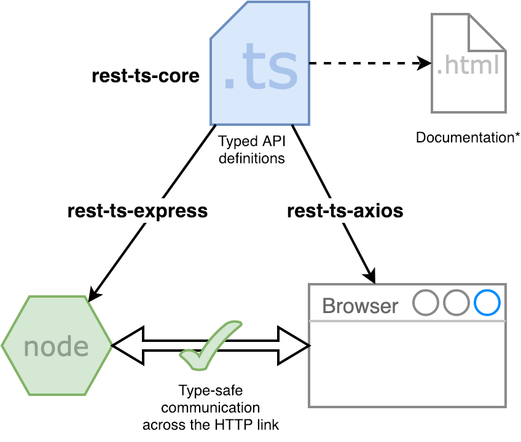

# <a name="readme"></a> Rest.ts [](https://travis-ci.org/hmil/rest.ts) [](https://www.npmjs.com/package/rest-ts-core) [](https://github.com/hmil/rest.ts#readme) [](http://code.hmil.fr/rest.ts/index.html)

Type safety across REST APIs in TypeScript!

---

Table of contents:
- [What is this](#intro)
  - [Project status](#dev-status)
- [Getting Sarted](#getting-started)
- [Usage with runtypes](#runtypes)
- [Documentation](#documentation)

## <a name="intro"></a> What is this?

Rest.ts lets you write API contracts that tie together consumers and producers within the type system. Out of the box, Rest.ts gives you the following features:
- Auto-completion / intelliSense
- Easy code navigation

[](http://code.hmil.fr/rest.ts/resources/elevator-pitch.png)

### <a name="dev-status"></a> Project status

This project is now past the _MVP_. It works pretty darn well, and the core use cases are covered with tests. However, there are certainly corner cases out there which haven't been tested. **Please give this project a try and, more importantly, leave some feedback in the issues section**.

## <a name="getting-started"></a> Getting started

### 1. Define your API

Use the utilities prvided by `rest-ts-core` to define your API with ease:

```ts
import { defineAPI, GET, POST } from 'rest-ts-core';

class Flower {
    id: string;
    color: string;
    name: string;
}

class FlowerDetail extends Flower {
    discoverer: string;
    description: string;
    extinct: boolean;
}

const FlowerIndexedAttribute = 'name' as 'name' | 'color';

export const FlowerAPI = defineAPI({
  
    listFlowers: GET `/flowers`
        .query({
            'sortBy': FlowerIndexedAttribute,
            'filterBy': FlowerIndexedAttribute
        })
        .response(Flower[]),
        
    addFlower: POST `/flowers`
        .body(Flower)
        .response({ id: 'string' }),
        
    getFlowerDetails: GET `/flowers/${'id'}/details`
        .response(FlowerDetail)
});
```

### 2. Create a server for this API

Use `rest-ts-express` to create a binding for an expressjs server.

```ts
import { createRouter } from 'rest-ts-express';
import { FlowerAPI } from './flowerAPI';

const myApiRouter = buildRouter(FlowerAPI, (_) => _
    .listFlowers(async (req, res) => {
        // Write your handler code here and return the response like so:
        return myFlowersObject;
    })
    
    .addFlower(async (req, res) => {
    
    })
    
    .getFlowerDetails(async (req, res) => {
    
    })
);

// ... then, in your express application:

app.use('/api', myApiRouter);

```

### 3. Consume the API

The package `rest-ts-axios` lets you bind an API definition to an instance of axios<sup>*</sup>.

```ts
import { createConsumer } from 'rest-ts-axios';
import { FlowerAPI } from './flowerAPI';

const driver = axios.instance({
    baseURL: 'http://localhost:3000/api',
    // You can add global settings here such as authentication headers
});

// Create the binding once...
const api = createConsumer(FlowerAPI, driver);

// ...then use it anywhere in your client code
const roseResponse = await api.addFlower({
    body: new Flower('red', 'rose')
});

// The response is fully type-checked out of the box!
roseResponse.data.id; // type: string
```

<sub><sup>*</sup>[axios](https://github.com/axios/axios) is the best cross-platform HTTP client for TypeScript out there.</sub>

## <a name="runtypes"></a> Runtypes

**Rest.ts works best with [runtypes](https://github.com/pelotom/runtypes)**.  
If you define your DTOs with runtypes, then `rest-ts-express` automatically takes care of validating the incoming data against the expected type. This helps you prevent bugs and vulnerabilities by [not trusting user input](https://www.owasp.org/index.php/Don%27t_trust_user_input) and [enforcing type checking at the boundary](https://lorefnon.tech/2018/03/25/typescript-and-validations-at-runtime-boundaries/).

```ts
import * as rt from 'runtypes';
import { defineAPI, GET, POST } from 'rest-ts-core';

const Flower = rt.Record({
   name: rt.String,
   color: rt.String,
   id: rt.String
});

// Note how runtypes makes it less awkward to define union types
const FlowerIndexedAttribute = rt.Union('color', 'name');

export const flowerAPI = defineAPI({
    listFlowers: GET `/flowers`
        .query({
            'sortBy': FlowerIndexedAttribute,
            'filterBy': FlowerIndexedAttribute
        })
        .response(rt.Array(Flower))

    addFlower: POST `/flowers`
        // POST body data will be validated by the server. If it doesn't
        // conform to the expected type, a 400 error is returned.
        .body(Flower)
        .response(rt.Record({
            id: rt.String
        }))
});
```

## <a name="documentation"></a> Documentation

If you are looking for advanced features, you might want to take a look at the API documentation for the module you are using:

- [rest-ts-core](http://code.hmil.fr/rest.ts/modules/rest_ts_core.html)
- [rest-ts-express](http://code.hmil.fr/rest.ts/modules/rest_ts_express.html)
- [rest-ts-axios](http://code.hmil.fr/rest.ts/modules/rest_ts_axios.html)
